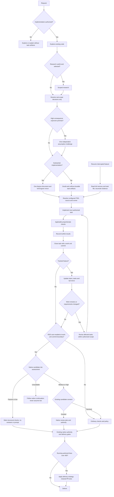

# Usage

← [Back to README](../README.md)

---

## Organic Driven Development (ODD)

ODD keeps the existing explore → implement → proportionate checks flow. For substantial, authorized implementation, the agent automatically creates one feature document after exploration; you do not need to request task tracking or choose a storage mode. Small, understood work creates no durable task artifacts. Explanation, investigation, and proposal-only requests remain read-only.

### The ODD protocol

ODD runs by default on every request, in every configured runtime, without you asking for a workflow, a plan, or task tracking.

1. **Authorize** — establish whether the request authorizes a change; read-only work stays read-only.
2. **Explore** — explore the existing code and requirements first, proportionately to the request.
3. **Resolve uncertainty** — optional research for a named uncertainty, one focused question for a real product decision, at most one assumption challenge for a high-consequence unproven premise.
4. **Classify** — substantial when exploration yields two or more meaningful implementation steps or progress worth recovering; small, understood work stays small.
5. **Track before the first write** — for substantial work, create the feature document and its Engram mirror before the first source write, and tell you in one line which document was created and how many tasks it holds.
6. **Implement task by task** — route each task through the smallest useful topology with the configured TDD mode and applicable checks; check items off only with observed proof. Every task closes with at least one work-unit commit on the feature branch (branch first when on the default branch), with tests and docs alongside the behavior, using a Conventional Commit message; the feature document records the commit identity as evidence.
7. **Close** — report the verified outcome, every failed or pending check, and the next step. The native review candidate is a work-unit commit or a PR slice, never a TODO checkbox and never the accumulated feature branch.

- **One feature document:** `odd/tasks/<feature-name>.md` holds objective, problem, why, scope, constraints, an actionable checklist with stable IDs and acceptance criteria, verification evidence, progress, and next step. Keep concise rationale for meaningful accepted changes here, not a separate plan or exhaustive decision journal. Project-scoped Engram topic `odd/<feature-name>/tasks` mirrors the full current document and file locator.
- **Task size:** about 400 authored changed lines (additions plus deletions) per task is only a planning heuristic, not a task acceptance criterion, hard cap, counter-trigger, automatic stop, forced split, or RDD trigger. Keep the smallest coherent behavior with its tests and docs. If the correct, clear solution naturally exceeds it, briefly explain why and continue without size-only rework loops. Never delete spaces, blank lines, or comments for cosmetic savings, omit tests, minify, add gratuitous abstractions, or split artificially. Forward the same advisory-only instruction to delegated subagents. Existing repository policy and separate PR size gates remain unchanged.
- **Changes:** accepted user, review, or verification changes update affected intent and tasks together, preserve valid completed and unrelated work, and add new tasks or reopen invalidated tasks with a reason. Findings alone do not authorize expansion or automatic acceptance; routine corrections stay with their tasks. Checkoffs require observed outcomes and applicable proof; they are not approval or a review receipt. New business scope still needs your authorization.
- **TDD:** resolve on/off from existing project/session configuration or explicit user choice, retaining source and exact runner in the feature document when present; tests existing does not enable it. Forward mode/source/runner to every implementation worker and refresh on resume. Enabled means observed RED before implementation → GREEN → REFACTOR; disabled still runs ordinary functional checks. Unknown/conflicting mode or a missing runner needs only the clarification affecting the next action—never invent precedence or a runner.
- **Checking:** run applicable functional checks per task; a TODO checkbox does not trigger a review cycle. The native review candidate is a work-unit commit or a PR slice, never a TODO checkbox and never the accumulated feature branch. After each work-unit commit, when RDD is enabled, assess it with `ordo review assess --cwd <repo> --agent <runtime> --base-ref <last reviewed boundary> --committed-only --json` and read `review_due` and `review_due_reason` from the returned envelope. When `review_due` is `true` (`high_risk` or `slice_budget_reached`), execute the returned `next_transition.command` verbatim — it is the exact preflight STATUS invocation for the same `--base-ref`/`--committed-only` selectors — and follow the transitions it returns; the reviewed boundary advances to this commit once that review is acknowledged. When `review_due` is `false`, record the reason (`passive`, `under_budget`, or `already_reviewed`) and continue: a `passive` commit needs no review and the boundary advances immediately, an `under_budget` medium commit stays pending in the slice until a later commit reaches the delivery budget, and `already_reviewed` means this exact range is already covered by terminal authority. The first boundary is the branch point, and every reviewed boundary becomes the next base. Record the assessed tier and outcome per task: `review_due`/`review_due_reason`, or the transition's acknowledged/declined/unavailable outcome. Existing risk, consent, and authority stay unchanged; never infer low risk from a failed assessment. Never skip an existing delivery gate.
- **Delivery:** at feature-document creation, forecast authored changed lines (additions plus deletions, generated files excluded) from the task list, and keep a running count from work-unit commits. Choose one delivery strategy per feature: `ask-on-risk` (default), `auto-chain`, `single-pr`, or `exception-ok`. When the forecast or running count exceeds about 400 authored changed lines, apply the chosen strategy before the next commit. `ask-on-risk` asks once for the chain strategy (`stacked-to-main` or `feature-branch-chain`); `auto-chain` asks only for a missing chain strategy and slices automatically. Cache both choices, and record slice boundaries (which commits each PR holds) in the feature document. Resolve the `work-unit-commits` and `chained-pr` skills by registry name before planning or creating any PR.
- **RDD consent:** when enabled, native candidate risk assessment comes first: passive/low stays silent with structural checks, no reviewer, and no consent ceremony; medium/high presents existing candidate consent and runs the native review plan only on grant. Declining uses ordinary policy. Disabled RDD never starts or prompts; ordinary checks remain. This is prospective change risk, not defect severity or a model-selected threshold. Failed assessment never implies low risk; existing native continuations and authority still apply.
- **Resume:** before implementation or resume, the parent reads the full feature-specific Engram observation and actual task file, reconciles current code and evidence, and passes the locator and relevant context; the worker reads the document before edits. Read back both writes: they are not atomic. If Engram is unavailable, keep local progress and report the pending mirror; preserve conflicting versions rather than silently overwriting one.
- **Uncertainty:** research is optional, and a concise proposal is useful only for a real decision. A high-consequence unproven assumption can receive one independent read-only challenge—even in a small security-critical change. Deterministic failures need fixes, not debate; native RDD claims stay with its own refuter.

### Why ODD is the development workflow

ODD keeps intent, progress, and evidence in one feature document for substantial work. Small work needs no durable task artifacts.

### Research depth without a new phase

ODD research establishes the problem, intended outcome, constraints, and current evidence, then inspects relevant code. Depth adapts to uncertainty and consequence: no fixed questionnaire or mandatory rounds. Only real unresolved product decisions prompt a focused user question, one at a time with a stop/wait; delegated workers return gaps to the parent rather than assume choices.

Questions needing external evidence use available authorized documentation/web tools, preferably primary sources. Findings attribute material claims to URLs or code locations and distinguish verified facts, assumptions, contradictions, freshness, and gaps. The concise handoff includes a recommendation, tradeoffs, open questions, and implementation implications. A proposal is needed only for a real decision; unavailable tools are disclosed, never invented, and only unsafe decisions dependent on missing evidence pause.

When delegated, these instructions go to an existing fresh general exploration/research worker. Research stays read-only and introduces no new runtime command or persistence gate.



ODD adds shared agent guidance, not a new CLI, state engine, or mandatory planning phase. Instruction tests establish delivery, not autonomous compliance with every create/update/resume step. Existing risk-based functional checks and the user-owned RDD switch are unchanged; ODD never enables RDD.

Gentle Shell (the `gentle-pi` package) owns its separate ODD prompt delivery. Updating Gentle AI's shared renderer does **not** establish Pi parity; parity requires observing the same file, memory, update, and resume behavior in Pi, not merely matching prompt text.

---

## Persona Modes

| Persona   | ID          | Description                                                                       |
| --------- | ----------- | --------------------------------------------------------------------------------- |
| Gentleman | `gentleman` | Teaching-oriented mentor persona — pushes back on bad practices, explains the why |
| Neutral   | `neutral`   | Same teacher, same philosophy, no regional language — warm and professional       |
| Custom    | `custom`    | Keep your existing persona/config unmanaged — ordo does not inject a persona |

`custom` is a compatibility/ownership choice, not a persona editor. Use it when you already have your own persona instructions and want ordo to leave them alone.

---

## Interactive TUI

Just run it — the Bubbletea TUI guides you through agent selection, components, skills, presets, and managed uninstall flows:

```bash
ordo
```

The uninstall flow is also available from the TUI menu. It lets you:

- select one or more configured agents
- select which managed components to remove (for example `persona` or `context7`)
- confirm the exact uninstall scope before applying changes

Before any managed file is modified, `ordo` creates a backup snapshot so the configuration can be restored later if needed.

### Import memories

**Import memories** in the TUI menu runs [`ordo memory import`](#memory-import) step by step:

1. Enter a file or directory (`~` and `~/` are expanded). Ordo scans it once in the background; Esc while it shows "Scanning…" goes back to the path. An empty path, a missing path, or input with no entries shows an error on the same step.
2. Enter the Engram project. It defaults to the name of the git repository containing the current directory, else the directory's own name.
3. Review the preview: the entry count and each entry's title, source, and sync ID (the same IDs as `--dry-run`). The import uses exactly these entries; files changed after the scan are not picked up until you scan again.
4. Press Enter to import. The result screen shows Engram's summary or the error, such as `engram` not being installed. Press any key to return to the menu.

Esc goes back one step. The TUI always uses each record's own type and never forces updates; use the CLI for `--type` and `--force`.

### Receipt-Driven Development during installation

Before the final installation confirmation, the customizable installer explains Receipt-Driven Development (RDD) and asks you to choose **RDD ON** or **RDD OFF**. RDD records bounded, independent review evidence for a frozen change candidate and supports a bounded correction process. It can add review time and model cost.

The selection defaults to ON when no global preference exists; choose **Disable RDD** to opt out. An existing explicit global OFF remains selected. You can return from the confirmation screen to revise it. Gentle AI saves the selected global setting only after installation succeeds; an interrupted or failed installation leaves it unchanged. Existing clone-local overrides remain unchanged, so a clone's effective mode can differ from the global setting. RDD evidence does not authorize commits, pushes, pull requests, or releases; ordinary repository policy still governs delivery.

### Disable TUI spinner animation

Set `GENTLE_AI_NO_ANIMATION=1` to keep TUI spinner frames static:

```bash
GENTLE_AI_NO_ANIMATION=1 ordo
```

This disables only spinner animation; install, update, sync, and uninstall operations continue normally. Unset the variable, or use any value other than `1`, to keep the default animation behavior.

---

## CLI Commands

### install

First-time setup — detects your tools, configures agents, injects all components. When installing a single agent with `--agent X`, gentle-ai **merges** the new agent into the existing `installed_agents` list in `state.json` and **preserves** any existing `model_assignments` — it does not overwrite the full state.

```bash
# Full ecosystem for multiple agents
ordo install \
  --agent claude-code,opencode,gemini-cli \
  --preset full-gentleman

# Minimal setup for Cursor
ordo install \
  --agent cursor \
  --preset minimal

# OpenClaw setup after installing OpenClaw manually
ordo install \
  --agent openclaw \
  --preset full-gentleman

# Pick specific components and skills
ordo install \
  --agent claude-code \
  --component engram,skills,context7,persona,permissions \
  --skill go-testing,skill-creator,branch-pr,issue-creation \
  --persona gentleman

# Dry-run first (preview plan without applying changes)
ordo install --dry-run \
  --agent claude-code,opencode \
  --preset full-gentleman
```

### skill-registry refresh

Refresh the project-local skill registry used by orchestrators before they delegate work:

```bash
ordo skill-registry refresh
ordo skill-registry refresh --force
ordo skill-registry refresh --cwd /path/to/project --quiet
```

The command scans project skills first (`skills/`, `.opencode/skills/`, `.claude/skills/`, `.github/skills/`, and other supported workspace skill roots), then global agent skill directories. Project-local skills win over same-name global skills.

The command writes `.atl/skill-registry.md` and `.atl/.skill-registry.cache.json`. The cache fingerprint includes schema version plus each discovered `SKILL.md` file path, mtime, and size, so normal startup is a cheap cache-hit when skills have not changed.

Codex, Claude Code, and OpenCode installs wire this command into startup/plugin hooks. Pi gets the equivalent behavior from `gentle-pi`; keep those hook/plugin scan roots in sync when changing these discovery rules.

See [Skill Registry](skill-registry.md) for the full index-first flow and diagrams.

### memory import

Load curated knowledge (team conventions, decisions, known-good answers) into your local Engram™ memory so agents start with it:

```bash
ordo memory import ./golden --project my-app --dry-run   # preview, writes nothing
ordo memory import ./golden --project my-app
ordo memory import ./faq.csv --project my-app --type decision
ordo memory import ./golden --project my-app --force     # apply edits whose mtime did not change
ordo memory import ./documents.json --project my-app --title-field slug
```

| Input | Each memory is |
| :--- | :--- |
| `.md` | one `## ` section (title = heading); a file with no `## ` is one memory titled by its file name |
| `.csv` | one row; the header needs `title,content` and may add `type` |
| `.jsonl` | one `{"title","content","type"}` object per line |
| `.json` | one object of a top-level array, or of the single array an object holds (for example `{"documents": [...]}`) |
| directory | every `.md`, `.csv`, `.jsonl`, `.json` file inside, in sorted order; hidden directories, `node_modules`, and `vendor` are skipped, and so is any `.json` file that is not a dataset (invalid JSON or not an array of objects, such as `package.json`), with a `skipped` notice on stderr |

- `--project` is required. `--type` sets the type for every memory; otherwise the record's `type`, else `manual`.
- A `.json` record is titled by `--title-field <name>` when given; otherwise by the first non-empty `title`, `titulo`, or `name`, written as `<id> — <title>` when the record also has a different `id` (or `id` alone). A non-empty string `content` field is the memory's content; otherwise every other field (except the title fields and `type`) renders as labeled text in source order: `Label: value` for scalars, comma-joined scalar arrays, indented nested objects, and numbered items for arrays of objects. Null and empty values are skipped. The record's `type` string sets its type.
- Titles must be unique per file, and content must be non-empty and at most 8000 characters.
- Markdown, CSV, JSONL, and JSON files may start with a UTF-8 BOM. In Markdown, `## ` lines inside fenced code blocks (backticks or tildes) are content.
- `--force` updates every memory even when the source file's modification time did not advance, for example after `cp -p`, `rsync -a`, or extracting an archive.
- Ordo converts the input and runs `engram import`; it never writes Engram's database directly. It needs `engram` on `PATH` (or in Homebrew's bin directory). Ctrl-C stops `engram import` and removes the temporary import file.
- Re-importing is safe. See [Engram: importing curated memories](engram.md#importing-curated-memories).

### Community Tools

The installer’s **Community Tools/Plugins** screen offers opt-in integrations that are never selected by a preset or detection.

### sync

Refresh managed assets to the current version. Run it after replacing or upgrading the `ordo` binary, including with `brew upgrade`, `ordo upgrade`, or `go install`. It does NOT reinstall binaries (engram, GGA) — only updates managed prompts, skills, MCP configs, and agent guidance.

Managed reviewer and runtime assets are version-bound to the binary. Until sync succeeds, review lifecycle operations fail closed when managed writer provenance is missing or mismatched.

> **Important:** `ordo sync` updates the agents recorded as installed by Gentle AI™, not every AI agent config directory on your machine.
>
> Gentle AI stores your selected install targets in `~/.gentle-ai/state.json`. Future `sync` runs use that stored selection so Gentle AI does not accidentally write into tools you did not choose to manage. If you rerun install and select only one agent, that new selection becomes the default sync scope.
>
> Before syncing, you can preview the active scope with `ordo sync --dry-run`. If you want to sync agents outside the stored selection, pass them explicitly with `--agent`.

```bash
# Preview which agents sync will update
ordo sync --dry-run

# Sync the agents currently registered in ~/.gentle-ai/state.json
ordo sync

# Sync specific agents only
ordo sync --agent claude-code --agent opencode

# Refresh OpenClaw workspace instructions and MCP config
ordo sync --agent openclaw
```

Sync is safe and idempotent — running it twice produces no changes the second time. When files change, the summary reports the changed file count and lists the changed file paths.

`sync` refreshes the managed component set for the selected agents. It does not support `--component`; use `--include-permissions` or `--include-theme` for the opt-in components that are excluded from the default sync scope.

After upgrading the binary, `ordo sync --dry-run` previews the selected targets; `ordo sync` refreshes their primary remote-authorization guidance. To select a specific managed client, use e.g. `ordo sync --agent opencode`. This behavioral section is delivered with unconditional routing guidance, without requiring persona or `--include-permissions`. It requires explicit destination, operation, and credential/session authorization before remote work or ambient access discovery/reuse.

This update covers the 15 non-Pi primary instruction carriers only. Executor roles and Pi's package-owned instructions require separate behavioral coverage. Existing automation modes and remembered approvals may suppress runtime prompts. The guidance is not a sandbox or a fresh-human-per-execution guarantee. Shared settings merging and historical profile cleanup (compatibility for existing user configurations) preserve existing permission-rule order.

For OpenCode native remote-command asks, opt in separately: `ordo sync --agent opencode --include-permissions` (or `--agent kilocode` for the shared generated configuration). Defaults ask for direct `ssh`, `scp`, `sftp`, and `rsync`, bare or with arguments; local-only rsync also asks conservatively. Existing restrictions and explicit custom allows remain authoritative, so custom configurations may still allow remote commands. Defaults do not rewrite those personal allows. Agent overrides and remembered approvals may also bypass a prompt.

Matcher fixtures follow OpenCode [v1.2.27 wildcard matching](https://github.com/anomalyco/opencode/blob/v1.2.27/packages/opencode/src/util/wildcard.ts) and its last-matching permission evaluation. They do not prove interception of absolute executable paths, env wrappers, interpreters, or arbitrary compound shell syntax; the runtime extracts command nodes separately. Kilocode runtime equivalence is not verified. Issue #4324 remains open for all-client/all-role completion.

For OpenClaw, sync reads the active workspace from `~/.openclaw/openclaw.json` (`agents.defaults.workspace`). It writes `AGENTS.md` / `SOUL.md` into that workspace, while MCP servers stay in the global OpenClaw config under `mcp.servers`.

For Hermes, ordo is detect-only: it cannot install Hermes. Install Hermes manually first. Detection is driven by the `~/.hermes` config directory (the binary being on `PATH` is reported separately). Once Hermes is detected, `ordo install --agent hermes` injects context7 and Engram™ MCP blocks into `~/.hermes/config.yaml`, writes ODD guidance and persona into `~/.hermes/SOUL.md`, and copies skills to `~/.hermes/skills/`. Use `ordo sync --agent hermes` to update the managed configuration after upgrades.

### uninstall

Remove only the `ordo` managed configuration from one or more agents. This does not uninstall external packages or binaries — it removes managed prompt sections, MCP entries, skills/config fragments, and other managed files, then updates `state.json` accordingly.

Before any change is applied, `ordo` creates a backup snapshot of the affected files.

```bash
# Partial uninstall for specific agents
ordo uninstall \
  --agent claude-code \
  --agent opencode

# Partial uninstall for specific components only
ordo uninstall \
  --agent claude-code \
  --component persona,context7

# Complete uninstall of managed config from all supported agents
ordo uninstall --all

# Skip confirmation prompt
ordo uninstall --agent cursor --component skills --yes
```

If no `--component` flag is provided for a partial uninstall, `ordo` removes all managed uninstallable components for the selected agent set.

### update / upgrade

Check for and install new versions of `ordo` itself. The pre-upgrade backup snapshot covers only the agents recorded in `state.InstalledAgents` (`~/.gentle-ai/state.json`) — not every agent config directory that exists on your machine.

```bash
# Check if a newer version is available
ordo update

# Upgrade to the latest release (downloads new binary, replaces current)
ordo upgrade
```

After any upgrade or manual binary replacement, run `ordo sync` to refresh all managed assets to the new version's content.

If GitHub rate-limits update checks, export `GITHUB_TOKEN` or `GH_TOKEN` before running `ordo update`/`upgrade`.

If Homebrew refuses an upgrade from an untrusted tap, trust only the artifact Homebrew names and retry the upgrade:

```bash
# Formula tools, for example ordo
brew trust --formula gentleman-programming/tap/ordo
brew upgrade ordo

# Cask tools, for example engram
brew trust --cask gentleman-programming/tap/engram
brew upgrade engram
```

If you choose to install several tools from this tap, run `brew trust gentleman-programming/tap` instead. This broader option trusts all current and future formulas, casks, and external commands published in the tap.

**Self-update prompt behavior** (changed in v1.x slice 5 — `GENTLE_AI_CONFIRM_UPDATE` removed):

| Situation | Behavior |
|-----------|----------|
| Interactive terminal (TTY) | Always prompts `Apply now? [Y/n]`. Empty Enter accepts. |
| Non-TTY (CI, pipe, script) | Auto-declines — never hangs. |
| `GENTLE_AI_YES=1` | Auto-accepts without prompting (for scripted upgrades). This variable is inherited by subprocesses, so scope it to a single invocation when needed (e.g. `GENTLE_AI_YES=1 gentle-ai …`). |
| `GENTLE_AI_NO_SELF_UPDATE=1` | Skips the self-update check entirely. |

`GENTLE_AI_CONFIRM_UPDATE` was removed in slice 5. It is now ignored if set.

`GENTLE_AI_SELF_UPDATE_DONE` is an internal loop guard and should not be set manually.

### model assignment

The TUI **Configure Models** screen lets you assign models to supported agents, including Judgment Day roles (`jd-judge-a`, `jd-judge-b`, `jd-fix-agent`). Configure the available slots for your selected agent.

### doctor

Read-only ecosystem health diagnostics — no changes made to your configuration:

```bash
ordo doctor
```

Checks performed:

| Check | What it verifies |
|-------|-----------------|
| Tool binaries | Required tools present on `PATH`; shadow detection (wrong binary resolves first) |
| `state.json` validity | Parses `~/.gentle-ai/state.json` and reports any schema/corruption issues |
| Engram MCP reachability | Confirms the Engram MCP server responds |
| Disk space | Warns when available space is critically low |

Each check reports **pass**, **warn**, or **fail** with an optional remedy hint. Run `doctor` first when troubleshooting an unexpected install or sync result.

### version

```bash
ordo version
ordo --version
ordo -v
```

---

## CLI Flags (install)

| Flag                          | Description                                                                                                       |
| ----------------------------- | ----------------------------------------------------------------------------------------------------------------- |
| `--agent`, `--agents`         | Agents to configure (comma-separated)                                                                             |
| `--component`, `--components` | Components to install (comma-separated)                                                                           |
| `--skill`, `--skills`         | Skills to install (comma-separated)                                                                               |
| `--persona`                   | Persona mode: `gentleman`, `neutral`, `custom` (`custom` keeps your existing persona unmanaged)                   |
| `--preset`                    | Preset: `full-gentleman`, `ecosystem-only`, `minimal`, `custom` (`custom` means manual component/skill selection) |
| `--scope`                     | Install scope for agent-scoped files: `global` (default, writes to each selected agent's global config directory) or `workspace` (writes to the current project root). Also settable via `GENTLE_AI_INSTALL_SCOPE` env var for CI/non-interactive use. |
| `--dry-run`                   | Preview the install plan without applying changes                                                                 |

## CLI Flags (sync)

| Flag                     | Description                                                                                          |
| ------------------------ | ---------------------------------------------------------------------------------------------------- |
| `--agent`, `--agents`    | Agents to sync (defaults to all installed agents)                                                    |
| `--skill`, `--skills`    | Skills to sync (comma-separated; defaults to selected preset skills)                                  |
| `--strict-tdd`           | Enable Strict TDD Mode for ODD (sync only)                                                           |
| `--include-permissions`  | Include permissions sync (opt-in)                                                                    |
| `--include-theme`        | Include theme sync (opt-in)                                                                          |
| `--dry-run`              | Preview the sync plan without applying changes                                                       |

For OpenCode background execution, see [Native OpenCode background subagents](opencode-profiles.md).

## CLI Flags (uninstall)

| Flag                          | Description                                                             |
| ----------------------------- | ----------------------------------------------------------------------- |
| `--agent`, `--agents`         | Agents to uninstall managed config from (required unless using `--all`) |
| `--component`, `--components` | Managed components to remove only from the selected agents              |
| `--all`                       | Remove managed configuration from all supported agents                  |
| `--yes`, `-y`                 | Skip the confirmation prompt                                            |

---

## Typical Workflow

```bash
# First time: install everything
brew install gentleman-programming/tap/ordo
ordo install --agent claude-code,cursor --preset full-gentleman

# After a new release: upgrade + sync
brew upgrade ordo
ordo sync

# Remove only managed persona config from one agent
ordo uninstall --agent claude-code --component persona

# Adding a new agent later
ordo install --agent windsurf --preset full-gentleman
```

### Homebrew upgrade troubleshooting

Homebrew 6 can require explicit trust for non-official taps and, on Linux, can
sandbox builds with Bubblewrap. `ordo upgrade` and `scripts/install.sh`
auto-trust only the Gentle AI formula. For the broader tap-wide trust option,
see the [update and upgrade guidance](#update--upgrade). Manual upgrades may
still need this one-time command:

```bash
brew trust --formula gentleman-programming/tap/ordo
brew upgrade ordo
```

On Linux, if Homebrew reports that Bubblewrap cannot create a rootless sandbox,
there is nothing for Gentle AI to install: Bubblewrap is already present, but the
host blocks the rootless namespace primitives it needs. This is a security
tradeoff and should be an explicit admin decision. If your policy allows it,
fix the host namespace policy first:

```bash
sudo sysctl -w kernel.unprivileged_userns_clone=1
sudo sysctl -w user.max_user_namespaces=28633
sudo sysctl -w kernel.apparmor_restrict_unprivileged_userns=0 || true
```

Use `HOMEBREW_NO_SANDBOX_LINUX=1 brew upgrade ordo` only as a final
workaround when your distro policy forbids the namespace settings; it disables
Homebrew's Linux sandbox for that command.


---

## Dependency Management

`ordo` auto-detects prerequisites before installation and provides platform-specific guidance:

- **Detected tools**: git, curl, node, npm, brew, go
- **Version checks**: validates minimum versions where applicable
- **Platform-aware hints**: suggests `brew install`, `apt install`, `pacman -S`, `dnf install`, or `winget install` depending on your OS
- **Node LTS alignment**: on apt/dnf systems, Node.js hints use NodeSource LTS bootstrap before package install
- **Dependency-first approach**: detects what's installed, calculates what's needed, shows the full dependency tree before installing anything, then verifies each dependency after installation
